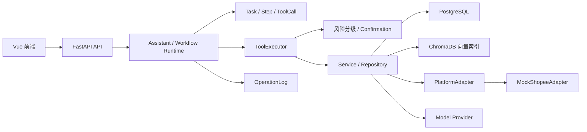

# SellPilot

**跨境电商智能运营助手平台**

SellPilot 面向跨境电商店铺运营，以 Shopee 业务流程作为主要演示场景，统一商品、库存、
订单、物流、客服和 AI 运营任务。系统通过 Workflow、Branch、Loop、ToolExecutor 和
Confirmation 组织可追踪的执行链；当前所有外部平台读取与写入均使用
`MockShopeeAdapter`，不连接真实 Shopee 账号。

## 项目定位

SellPilot 主要处理以下运营问题：

- 商品、库存、订单、物流和客服数据分散，跨模块查询成本高；
- 选品、评论分析、产品改良和内容生成缺少一致的执行流程；
- AI 输出难以追踪到具体任务、步骤、工具调用和数据依据；
- 商品草稿、模拟发布和客服发送等写操作需要人工确认与审计；
- 客服回复需要结合商品事实、订单、物流和知识库依据，避免无依据回答。

当前代码以单用户、单模拟店铺的课程实训与演示环境为边界，不是多租户生产系统。

## 核心能力

- **AI 运营助手**：以中文聊天方式识别意图、补充参数、生成计划，并按能力状态创建或
  执行受控任务。
- **智能选品**：按站点、类目和价格条件检索市场候选，使用确定性规则评分并返回 Top N、
  风险和数据来源。
- **商品评论分析**：读取 PostgreSQL 中的 Mock 评论，输出情感分布、主题、痛点、代表评论和
  数据不足提示。
- **产品改良建议**：基于评论分析和证据生成结构化改良建议，并支持受确认保护的商品
  草稿操作。
- **多语言内容生成**：读取商品事实，生成标题、卖点、详情、FAQ 和关键词，并执行事实
  与合规检查。
- **商品管理**：查询商品、SKU 和商品内容版本，区分草稿与模拟平台操作。
- **SKU 与库存**：查看库存、检查低库存并生成补货建议；建议本身不自动调整库存。
- **订单与物流**：查询订单列表、单个订单和物流轨迹。
- **智能客服**：依据问题类型进入知识库、订单、物流、商品或人工处理分支，生成回复
  草稿。
- **知识库检索**：通过统一 RAG Service 检索知识文档，返回来源；空库或无可靠依据时
  明确拒答。
- **任务中心**：查看 Task、Step、ToolCall、Confirmation 和 OperationLog 的完整链路。
- **风险确认与操作审计**：按 READ、WRITE、HIGH_RISK 分级，写操作与高风险操作必须
  经过确认、幂等校验和审计记录。
- **经营看板**：汇总商品、库存、订单、评论和运营任务的演示指标。

当前代码注册 25 个 Tool、12 个 Workflow（含诊断和健康检查）以及 10 项 Assistant
Capability。实际可用性以服务端 Registry、运行环境、数据就绪状态和外部模型配置为准。

## 三条业务闭环

### 产品决策闭环

```text
市场数据 → 智能选品 → 评论分析 → 产品改良 → 改良报告 → 商品草稿
```

候选检索和评分使用 PostgreSQL 中的 Mock 市场数据；保存商品草稿属于写操作，必须进入
Confirmation。

### 商品运营闭环

```text
商品事实 → 多语言内容生成 → 事实检查 → 合规检查
        → 有界 Loop → 草稿 → Confirmation → Mock 操作
```

Loop 只在固定次数内修正内容，达到上限后返回明确失败。默认聊天请求只生成内容，不自动
保存或发布。

### 客服闭环

```text
买家消息 → 意图与风险识别 → RAG / 订单 / 物流 Branch
        → 回复草稿 → 人工处理或 Confirmation → Mock 发送 → 审计日志
```

Branch 按问题类型选择数据依据；退款、投诉、赔付、地址或订单修改、低置信度和无可靠依据
等情况转人工处理。客服消息不会自动发送到真实 Shopee。

## 系统架构



- API 路由负责协议转换、认证与 Schema 校验，业务逻辑位于 Service、Workflow 和 Tool。
- `TaskRunner` 从唯一 `WorkflowRegistry` 取得工作流，节点通过唯一 `ToolExecutor` 调用
  已注册工具。
- Task、Step、ToolCall、Confirmation 和 OperationLog 共同保存执行状态与审计关联。
- 正式数据库结构仅由 Alembic 迁移维护，应用启动时不使用 `create_all`。
- 平台业务通过 `PlatformAdapter` 抽象访问，不直接依赖具体 Mock 实现。

## 技术栈

| 层级 | 技术 |
| --- | --- |
| 前端 | Vue 3、TypeScript、Vite、Vue Router、Pinia、Element Plus、ECharts、Vitest |
| 后端 | Python 3.12、FastAPI、SQLAlchemy Async、Alembic、Pydantic、LangGraph |
| AI 与检索 | OpenAI 兼容模型接口、阿里云百炼兼容内容接口、Sentence Transformers、ChromaDB |
| 数据 | PostgreSQL 17、CSV Demo 数据；知识元数据存于 PostgreSQL |
| 集成 | 平台适配器、只读 MCP 健康工具、统一 Tool 与 Workflow Registry |
| 工程化 | uv、pytest、Ruff、npm、Docker Compose、GitHub Actions |

前端和后端应用元数据当前均为 `0.5.0`。具体依赖版本以
[`backend/pyproject.toml`](backend/pyproject.toml)、
[`backend/uv.lock`](backend/uv.lock) 和
[`frontend/package-lock.json`](frontend/package-lock.json) 为准。

## 项目目录

```text
SellPilot/
├─ backend/             # FastAPI、迁移、CLI、Tool、Workflow 和测试
├─ frontend/            # Vue 应用、页面、公共组件和前端测试
├─ data/                # 合成 Demo 数据与导入源
├─ docs/                # 架构、API、部署、测试、演示和发布文档
├─ scripts/             # Demo 初始化、就绪检查和 HTTP E2E Smoke
├─ .github/             # Pull Request CI
├─ docker-compose.yml   # PostgreSQL、backend、frontend 编排
└─ README.md
```

## 环境要求

- Windows PowerShell 5.1 或更高版本；
- Python 3.12；
- [uv](https://docs.astral.sh/uv/)；
- Node.js 22 与 npm；
- PostgreSQL 17；
- Docker Desktop（可选，用于 Compose 环境）；
- 可选的内容模型与 RAG 模型接口配置。

本地正式演示和发布验证使用 PostgreSQL，不建议切换到 SQLite。应用统一读取仓库根目录
`.env`；不要创建 `backend/.env`，也不要将 `.env` 提交到 Git。

## 环境变量

从 [`.env.example`](.env.example) 复制本地配置，只填写本机或部署环境的实际值。下表只
列出当前代码读取的配置，不提供任何密钥：

| 变量 | 用途 |
| --- | --- |
| `APP_NAME`、`APP_VERSION` | 应用名称与版本元数据 |
| `APP_ENV`、`DEBUG` | 运行环境与调试开关 |
| `API_HOST`、`API_PORT`、`API_V1_PREFIX` | 后端监听地址、端口和 API 前缀 |
| `DATABASE_URL` | PostgreSQL Async SQLAlchemy 连接地址 |
| `JWT_SECRET_KEY`、`JWT_ALGORITHM` | JWT 签名与算法 |
| `ACCESS_TOKEN_EXPIRE_MINUTES` | 访问令牌有效期 |
| `CORS_ORIGINS` | 允许的前端来源 |
| `LOG_LEVEL`、`FILE_MAX_SIZE_BYTES` | 日志级别与上传大小限制 |
| `PLATFORM_ADAPTER` | 平台适配器；当前演示使用 `mock` |
| `CONTENT_MODEL_PROVIDER` | 内容模型选择：离线模板或阿里云百炼兼容实现 |
| `DASHSCOPE_API_KEY`、`BAILIAN_BASE_URL`、`BAILIAN_MODEL` | 阿里云百炼兼容内容模型配置 |
| `BAILIAN_TIMEOUT_SECONDS`、`BAILIAN_INPUT_COST_PER_MILLION`、`BAILIAN_OUTPUT_COST_PER_MILLION` | 内容模型超时和本地成本估算 |
| `LLM_API_KEY`、`LLM_BASE_URL`、`LLM_MODEL` | RAG 回答使用的 OpenAI 兼容模型配置 |
| `SHOPEE_PARTNER_ID`、`SHOPEE_PARTNER_KEY`、`SHOPEE_SHOP_ID` | Real Adapter Stub 的预留校验配置 |
| `TOOL_DEFAULT_TIMEOUT_SECONDS`、`TOOL_MAX_TIMEOUT_SECONDS` | Tool 超时边界 |
| `TOOL_READ_MAX_ATTEMPTS`、`TOOL_RETRY_INITIAL_DELAY_MS`、`TOOL_RETRY_MAX_DELAY_MS` | 只读 Tool 的有界重试 |
| `TOOL_AUDIT_PAYLOAD_MAX_BYTES` | Tool 审计载荷大小限制 |
| `TASK_MAX_STEPS`、`TASK_DEFAULT_NODE_TIMEOUT_SECONDS`、`TASK_MAX_NODE_TIMEOUT_SECONDS` | Task 步骤与节点超时边界 |
| `TASK_MAX_ATTEMPTS`、`TASK_STATE_MAX_BYTES`、`TASK_STALE_EXECUTION_SECONDS` | Task 重试、状态大小和陈旧执行判定 |
| `VITE_API_BASE_URL`、`VITE_PROXY_TARGET` | 浏览器 API 基础路径和 Vite 开发代理目标 |

`VITE_*` 变量会暴露给浏览器，禁止存放密码、Token 或 API Key。生产环境要求强 JWT
Secret；`PLATFORM_ADAPTER=real` 或外部内容模型缺少必要配置时会明确失败，不会静默回退
到 Mock 或离线结果。

## 本地快速启动

### 1. 获取代码并创建本地配置

```powershell
git clone <repository-url>
cd SellPilot
Copy-Item .env.example .env
```

编辑根目录 `.env`，配置 PostgreSQL、JWT 和按需使用的模型变量。不要提交该文件。

### 2. 安装依赖

```powershell
cd .\backend
uv sync --frozen

cd ..\frontend
npm ci

cd ..
```

### 3. 初始化 PostgreSQL 和 Demo 数据

确保 PostgreSQL 已启动且 `DATABASE_URL` 指向目标数据库，然后执行：

```powershell
.\scripts\init-demo.ps1 -AdminUsername admin
```

脚本会执行 Alembic 升级、交互式创建首个管理员并幂等导入 Mock 商业数据。管理员密码在
隐藏提示中输入，不写入命令或日志。需要同时导入基础 Mock 知识文档时可增加
`-IncludeKnowledge`。

也可在 `backend` 目录逐项执行：

```powershell
uv run alembic upgrade head
uv run sellpilot-create-admin --username admin
uv run sellpilot-import-mock-data
```

### 4. 导入知识数据

普通幂等导入：

```powershell
cd .\backend
$env:PYTHONPATH = (Resolve-Path .\src).Path
uv run python -m sellpilot.cli.import_knowledge_data
```

Demo 全量重建：

```powershell
uv run --frozen python -m sellpilot.cli.import_knowledge_data --full-rebuild
```

`--full-rebuild` 只替换来源以 `products.csv#`、`reviews.csv#` 或
`customer_messages.csv#` 开头的可重建 Mock 文档及其向量，不删除用户上传文档，也不影响
商品、订单、评论或库存等业务表。执行前仍应检查目标 PostgreSQL、现有文档所有权和备份
策略。完整说明见[知识库初始化](docs/deployment/knowledge-base-initialization.md)。

### 5. 检查就绪状态

```powershell
cd ..
.\scripts\check-demo-readiness.ps1 -RequireKnowledge
```

该脚本检查 live、ready、Alembic、核心 Demo 数据、平台模式、模型配置布尔状态和知识库
统计，不输出密钥。也可在 `backend` 目录运行：

```powershell
uv run sellpilot-check-demo-readiness
```

### 6. 启动应用

在仓库根目录运行：

```powershell
.\start-sellpilot.bat --check
.\start-sellpilot.bat
```

启动器从根目录 `.env` 读取后端地址，复用已有健康 SellPilot 后端；未知进程占用端口时
只提示并停止，不会自动终止进程。默认访问：

- 前端：`http://127.0.0.1:5173`
- Live：`http://127.0.0.1:8000/api/v1/health/live`
- Ready：`http://127.0.0.1:8000/api/v1/health/ready`

也可分别启动：

```powershell
cd .\backend
uv run sellpilot-start-api

cd ..\frontend
npm run dev -- --host 127.0.0.1
```

只有后端独立开发时才按需使用 `uv run sellpilot-start-api --reload`；演示模式不启用 reload。

## Docker Compose

Compose 提供 PostgreSQL 17、backend 和 frontend 三个服务，默认
`PLATFORM_ADAPTER=mock`。当前代码不依赖 Redis 或 pgvector，因此不会额外启动这些服务。

```powershell
docker compose config
docker compose build
docker compose up -d
docker compose ps
```

backend 会等待 PostgreSQL 健康，执行 `alembic upgrade head` 后启动 API。首次启动仍需
显式初始化管理员和 Demo 数据：

```powershell
docker compose exec backend uv run --no-sync sellpilot-create-admin --username admin
docker compose exec backend uv run --no-sync sellpilot-import-mock-data
docker compose exec backend uv run --no-sync sellpilot-import-knowledge
docker compose exec backend uv run --no-sync sellpilot-check-demo-readiness
```

普通停止保留 PostgreSQL volume：

```powershell
docker compose down
```

共享环境必须自行设置安全的 `COMPOSE_DB_PASSWORD` 和 `COMPOSE_JWT_SECRET_KEY`。详细配置
和数据重置风险见 [Docker Compose 部署说明](docs/deployment/docker-compose.md)。

## 演示数据

[`data/demo/shopee_mock`](data/demo/shopee_mock) 包含合成的：

- 商品与市场趋势；
- SKU 与库存；
- 订单、订单明细、物流和物流轨迹；
- 评论与退货退款记录；
- 客服会话和消息。

这些数据具有稳定演示 ID，但不是真实店铺、商品、买家或订单数据。知识库数据通过独立
RAG 导入流程写入 PostgreSQL 元数据和 ChromaDB 向量索引；由 Mock CSV 生成的知识文档
仍属于 Mock 数据，不能作为非 Mock 知识来源验收。

## 测试与质量门禁

后端：

```powershell
cd .\backend
uv run ruff format --check .
uv run ruff check .
uv run alembic heads
uv run alembic upgrade head
uv run alembic current
uv run alembic check
uv run pytest -q
```

前端：

```powershell
cd .\frontend
npm run format:check
npm run lint
npm run typecheck
npm run test:run
npm run build
```

真实 HTTP E2E Smoke：

```powershell
$password = Read-Host "SellPilot password" -AsSecureString
.\scripts\e2e-smoke.ps1 -Username admin -Password $password
```

默认 Smoke 只验证读取链路；写操作、Confirmation 取消/确认和重复确认需要显式增加
`-IncludeWrites`。脚本只调用 API，不直接查询数据库伪装业务通过。

GitHub Actions 在面向 `develop` 或 `main` 的 Pull Request 以及这两个分支的 push 上运行：

- Python 3.12、PostgreSQL 17、Ruff、Alembic 和 pytest；
- Node.js 22、Prettier、ESLint、TypeScript、Vitest 和生产构建。

最近一次正式测试结果见[发布测试报告](docs/testing/release-test-report.md)；README 不固定
测试数量，以免后续新增用例后失真。

## 安全与风险控制

- 使用 Argon2 密码哈希、Bearer JWT 和用户资源所有权隔离；
- Tool 由服务端白名单和 Registry 选择，不接受用户指定内部 Tool；
- READ 操作保留 ToolCall 和 OperationLog，WRITE 与 HIGH_RISK 操作进入 Confirmation；
- 确认任务保存目标、风险说明和审计快照，并使用幂等机制防止重复执行；
- Task、Step、ToolCall、Confirmation 与 OperationLog 通过用户和关联 ID 追踪；
- API 使用 Request ID，公开错误不会返回 traceback、内部 Prompt 或敏感完整载荷；
- `.env`、密钥、数据库、日志、缓存和构建产物不得提交到仓库。

## Mock 与真实能力边界

### 当前实现

- PostgreSQL 业务数据、迁移和持久化任务记录；
- Assistant、TaskRunner、WorkflowRegistry、ToolRegistry、ToolExecutor 和 Confirmation；
- ToolCall、OperationLog、请求幂等、所有权隔离和结构化结果；
- 可配置的模型兼容接口，以及明确标记的离线内容模板；
- PostgreSQL 知识元数据、ChromaDB 向量索引和有来源的 RAG 检索；
- Mock Shopee 数据读取、商品操作和客服模拟发送。

### 当前不包含

- 真实 Shopee OAuth 与联网适配器；
- 向真实 Shopee 发布或更新商品；
- 向真实买家发送客服消息；
- 修改真实订单、地址、退款或赔付；
- 多租户、多店铺的生产级权限与部署；
- 财务、ERP、生产监控、备份和灾难恢复系统。

`RealShopeeAdapterStub` 只用于保持适配器契约，不执行真实网络请求。选择 real 模式但缺少
配置或实现时会失败，不会自动回退到 Mock。外部模型的鉴权、限流和可用性由供应商决定，
系统不会把供应商错误伪装为业务成功。

## 页面模块

当前正式前端页面包括：

- 登录；
- 经营看板；
- AI 运营助手；
- 市场数据；
- 智能选品；
- 评论与产品改良；
- 产品改良报告；
- 商品管理；
- 内容工坊；
- 上架与库存；
- 会话工作台；
- 知识库；
- 订单与履约；
- 任务中心。

浏览器中的页面名称、状态、工作流和任务类型以中文展示；稳定业务 ID 和折叠技术详情保留
原始标识。

## 文档导航

- [本地部署](docs/deployment/local-setup.md)
- [Docker Compose](docs/deployment/docker-compose.md)
- [知识库初始化](docs/deployment/knowledge-base-initialization.md)
- [演示脚本](docs/demo/demo-script.md)
- [API 文档索引](docs/api/README.md)
- [架构文档索引](docs/architecture/README.md)
- [Task 与 Workflow Runtime](docs/architecture/task-workflow-runtime.md)
- [Assistant Workflow Integration](docs/architecture/assistant-workflow-integration.md)
- [发布测试报告](docs/testing/release-test-report.md)
- [安全发布审计](docs/testing/security-release-audit.md)
- [v0.5.0 发布说明](docs/releases/v0.5.0.md)
- [下一候选版本说明](docs/release/next-release-notes.md)
- [Git 工作流](docs/git-workflow.md)

## 当前版本与状态

- 前端与后端权威版本字段：`0.5.0`；
- 已发布历史里程碑：`v0.5.0`；
- 当前 `feature/e2e-demo-freeze` 用于 v0.5.0 后的 E2E Demo Freeze 和最终交付收尾；
- 当前分支不是 v1.0.0，最终发布完成后再按正式流程统一版本；
- 发布阻塞、外部模型、知识来源和 Docker 验证状态以
  [发布阻塞清单](docs/testing/post-release-blockers.md)为准。

已发布 Tag 只指向 `main` 的稳定提交，不移动、不覆盖。

## 团队协作

- `feature/*`：短期功能或修复分支；
- `develop`：团队集成分支；
- `main`：稳定发布分支；
- 变更按 `feature → develop → main` 通过 Pull Request 评审；
- Tag 只建立在 `main` 已验收的稳定提交上。

完整约定见 [Git 工作流](docs/git-workflow.md)。

## 使用说明

仓库未包含独立开源许可证声明。本项目用于课程实训与演示，使用和分发应遵循项目及课程
要求。
